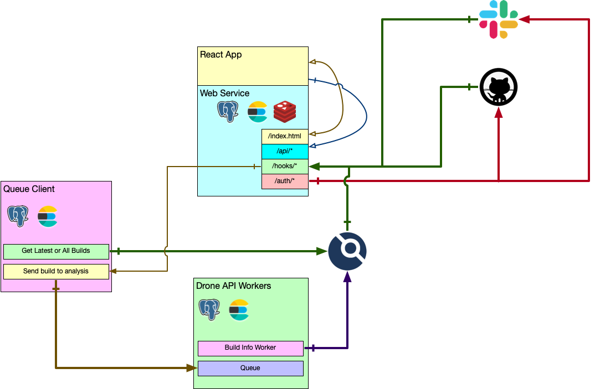

.. Drone CI Butler documentation master file, created by
   sphinx-quickstart on Wed Jun 23 14:22:47 2021.
   You can adapt this file completely to your liking, but it should at least
   contain the root `toctree` directive.

Drone CI Butler
===============

.. toctree::
   :maxdepth: 2
   :caption: Contents:

   introduction
   python-dsl
   yaml-dsl

**Drone CI Butler** is a Python-based service that monitors Drone-CI builds looking for error
patterns and notifies the authors of specific failures as github PR
comments or slack messages.

Indices and tables
==================

* :ref:`genindex`
* :ref:`modindex`
* :ref:`search`
