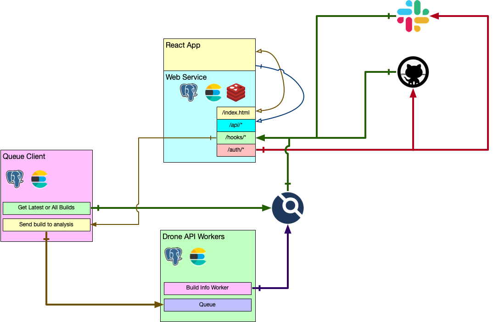

.. Drone CI Butler documentation master file, created by
   sphinx-quickstart on Wed Jun 23 14:22:47 2021.
   You can adapt this file completely to your liking, but it should at least
   contain the root `toctree` directive.

Introduction
============

**Drone CI Butler** is a Python-based service that monitors Drone-CI builds looking for error
patterns and notifies the authors of specific failures as github PR
comments or slack messages.

It implements an engine that matches *Rulesets* against Drone Builds, Stages and Steps.

- A *Ruleset* has one or more *Rules*
- A *Rule* as one or more *Conditions*
- A *Condition* has one or more *Matchers*
- A *Matcher* works with properties the drone elements:

  - ``build``
  - ``stage``
  - ``step``

- A *Matcher* can check if an attribute:
  - Has an exact **value**
  - **Contains String**
  - matches a **regular expression**
  - **is not** an exact value.

Domain-Specific Languages
-------------------------

The Rule Engine supports 2 DSL formats

- :ref:`Python <python dsl>`
- :ref:`Yaml <yaml dsl>`
